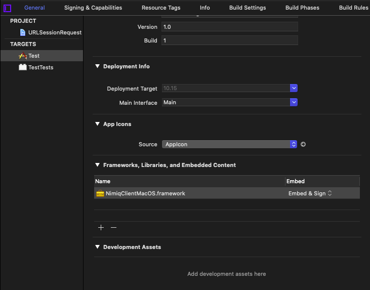

# Nimiq Swift Client (macOS, iOS, tvOS)

> Swift implementation of the Nimiq RPC client specs.

## Usage

Send requests to a Nimiq node with `NimiqClient` object.

```swift
let config = Config(
    scheme: "http",
    host: "127.0.0.1",
    port: 8648,
    user: "luna",
    password: "moon"
)

let client = NimiqClient(config: config)
```

Once the client have been set up, we can call the methodes with the appropiate arguments to make requests to the Nimiq node.

When no `config` object is passed in the initialization it will use defaults for the Nimiq node.

```swift
let client = NimiqClient()

// make rpc call to get the block number
let blockNumber = client.blockNumber()

print(blockNumber) // displays the block number, for example 748883
```

## API

The complete [API documentation](docs) is available in the `/docs` folder.

Check out the [Nimiq RPC specs](https://github.com/nimiq/core-js/wiki/JSON-RPC-API) for behind the scene RPC calls.

## Installation

The recommended way to install Nimiq Swift Client is with CocoaPods. CocoaPods is a dependency management tool for Xcode projects that
allows you to declare the dependencies your project needs and installs them into your project.

```sh
# Install CocoaPods
$ sudo gem install cocoapods
```

To enable CocoaPods in your project, close Xcode and in your project directory run:

```sh
$ pod init
```

Then you can add Nimiq Swift Client as a dependency modifying the created `Podfile`. To open the file for editing run `open -a Xcode Podfile`:

```sh
target "MyApp" do
    pod 'NimiqClient'
end
```

Finally install all the dependencies using CocoaPods: 

```sh
pod install
```

Alternatively, you can archive the framework target from Xcode > Product > Archive and add it to your application target.

Make sure the framework is added with the option Embed & Sign:



You can find out more on how to install CocoaPods and how to configure your Xcode proyecto to use it and install dependencies at [CocoaPods.org](https://cocoapods.org).

## Contributions

This implementation was originally contributed by [rraallvv](https://github.com/rraallvv/).

Please send your contributions as pull requests.

Refer to the [issue tracker](https://github.com/nimiq-community/swift-client/issues) for ideas.

### Develop

After cloning the repository, open the workspace file in NimiqClient/NimiqClient.xcworkspace instead of the project file.

All done, happy coding!

### Testing

Tests are stored in the `/Tests` folder and can be run from Xcode.

### Documentation

The documentation is generated automatically running Jazzy from the repository root directory. To install Jazzy run:

```
$ gem install jazzy
```

To generate the documentation run:

```
$ jazzy
```

## License

[MIT](LICENSE.md)
